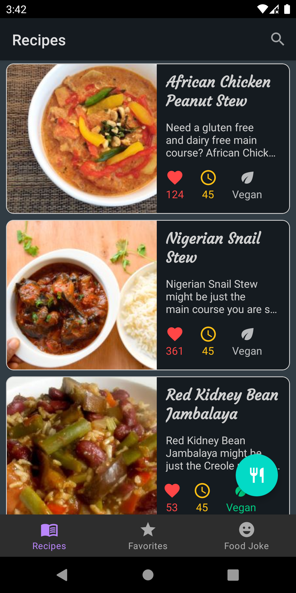
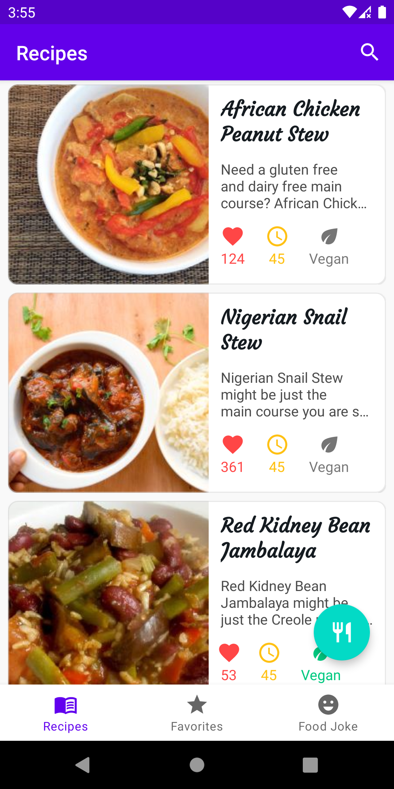
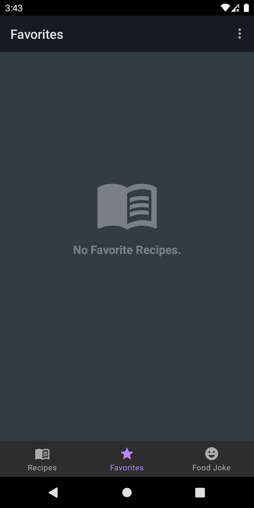
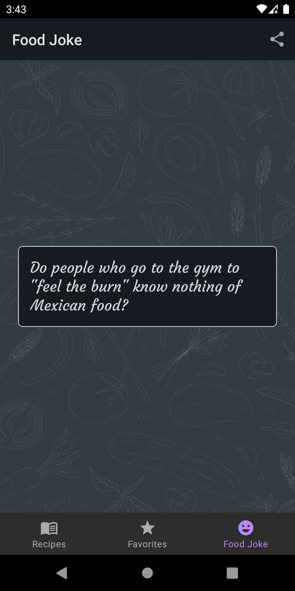
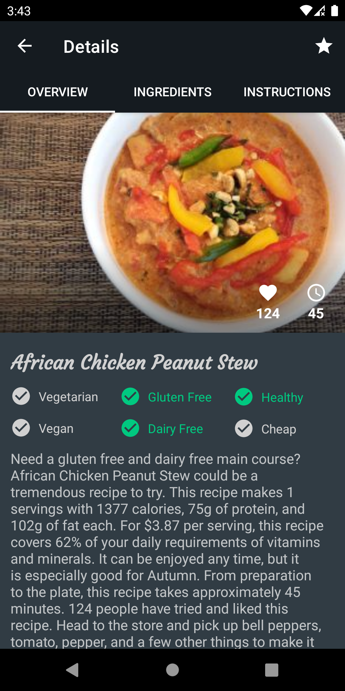
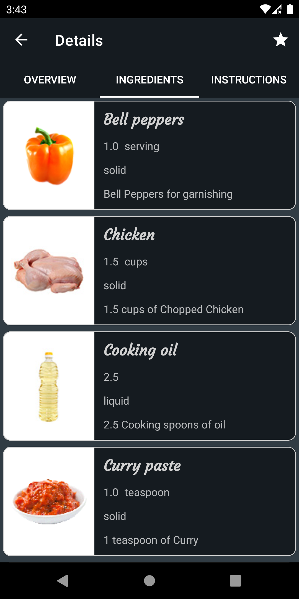
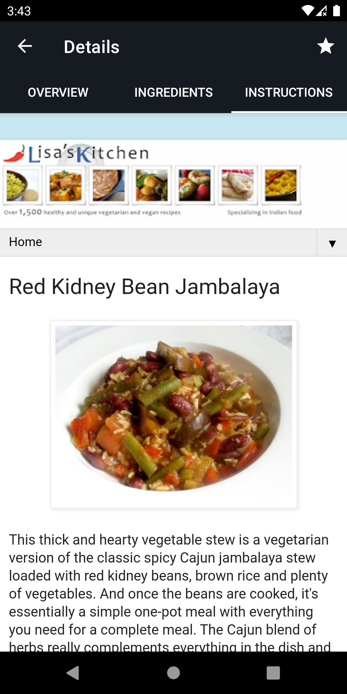
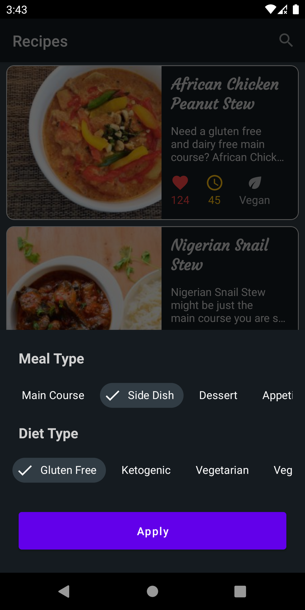

:star: A food recipes app.

:exclamation: You can download apk file from <a href="http://www.mediafire.com/file/q3pm6nbxlz16lqp/app-debug.apk/file">here</a>

<h3>:fire: Technologies i used</h3>
<ul>
  <li>Kotlin</li>
  <li>MVVM Architecture</li>
  <li>Dagger Hilt</li>
  <li>Data Binding</li>
  <li>View Binding</li>
  <li>StateFlow</li>
  <li>Offline caching</li>
  <li>Motion Layout</li>
  <li>Datastore Preferences</li>
  <li>Kotlin Coroutines</li>
</ul>

<h3>:fire: Screenshots from app</h3>

<table>
  <tr>
     <td style="text-align:center;">Recipes Page</td>
     <td>Light theme</td>
     <td>Favorite Recipes</td>
     <td>Food Jokes</td>
  </tr>
  <tr>
    <td valign="top"></td>
    <td valign="top"></td>
    <td valign="top"></td>
    <td valign="top"></td>
  </tr>
 
  <tr>
    <td>Recipe Overview</td>
    <td>Recipe Ingredients</td>
    <td>Recipe Instructions</td>
    <td>Filter recipes</td>
  </tr>
  
  <tr>
    <td valign="top"></td>
    <td valign="top"></td>
    <td valign="top"></td>
    <td valign="top"></td>
  </tr>
 
 
 </table>

